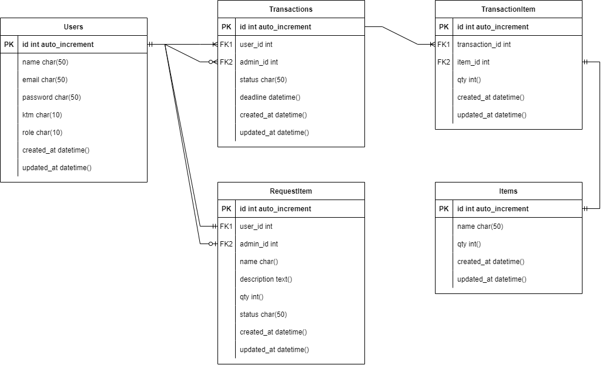

## (18) System Design

1. Diagram merupakan representasi simbolik informasi menggunakan teknik visualisasi. draw io merupakan tools yang paling sering digunakan karena free. banyak jenis desain, tetapi yang paling sering digunakan ada 4. pertama ada flowchart, yang merupakan sebuah representasi diagram yang memvisualisasikan alur atau proses. kemudian ada use case diagram yang merupakan ringkasan dari sebuah sistem kita dan interaksinya dengan pengguna aplikasi kita. ada juga ERD atau entity relationshid diagram, yang merupakan sebuah flowchart yang akan mengilustrasikan entitas sebagai user yang berelasi satu dengan lainnya. lalu ada high level architecture, yang merupakan desain sistem keseluruhan dan akan melakukan cek audience target.
2. desain basic sistem, terdapat 3 pertimbangan yaitu, bagain terkecil apa yang bisa kita gunakan, bagaimana bagian kecil tersebut bekerja satu sama lain, ketiga bagaimana mengoptimasi bagian tersebut. Dijawab dengan distributed systen concepts, artinya sistem yang kita jalankan dijalankan di multiserver. karakteristik dari sister terdistribusi yaitu, Scalability yaitu kapabilitas dari sitem, proses, atau jaringan untuk berkembang dan mengatur perkembangan permintaan. Kemudian realibility adalah sebuah kehandalan dari sistem yang mencegah sistem kita gagal ketika memberikan pelayanan. Lalu availibility yaitu ketersediaan dimana mengecek apakah sistem kita dapat diakses dalam 24 jam. Kemudian efficiency yang tidak memperbolehkan kita tidak boleh terlalu lama dalam melakukan load sistem maksimal 2 detik. terakhir ada serviceability atau manageability, agar dapat dilakukan maintanance pada suatu sistem dengan cara clean code. ketika user melakukan transaksi maka sistem akan berjalan di Job/Work Queue untuk mengatur tugasnya. ada juga load balancing untuk membagi traffic antara computer/server yang akan ditempatkan ketika user mengakses frontend juga dapat diberikan di database server. Monolitich adalah ketika mengembangkan sebuah projek yang semua servis nya dijadikan satu dalam satu projek, monolitik bisa dilakukan jika transaksi tidak banyak tetapi jika banyak maka kita perlu menggunakan microservices. microservices merukan servis yang ada dalam sebuah sistem yang akan dipecah pecah.
3. perbedaan SQL dan NoSQL, SQL adalah sebuah relational database yang saling berhubungan dan terstruktur, sedangkan NoSQL tidak terstruktur, tidak memiliki relasi, serta dinamis. Manfaat dari relational DB adalah dia dirancang untuk segala keperluan, lalu memiliki standard yang jelas, dan memiliki banyak tools. didalam relational DB ada 4 prinsip diantaranya, Atomicity dimana transaksi terjadi semua atau tidak sama sekali, Consistency data tertulis merupakan data yang valid yang ditentukan berdasarkan aturan tertentu, Isolation artinya memastikan bahwa transaksi dieksekusi seperti dikalankan secara sekuensial, dan Durability artinya jaminan bahwa transaksi yang telah tersimpan, tetap tersimpan. NoSQL adala cara pandang yang baru terhadap database, dimana dia tidak memiliki relasi. Not Only SQL(NoSQL) adalah DBMS lebih fleksibel dibanding RDBMS untuk menghindari transaksi ACID, kompleksitas SQL, Design Schema di depan, Transaction. Kelebihan NoSQL adalah pengembangannya cepat. Digunakan ketika membutuhkan skema fleksibel, ACID tidak diperlukan, data loggind, dll. Tidak digunakan ketika data finansial, data transaksi, dll. Caching merupakan sebuah penyimpanan data sementara. Cache akan disimpan di RAM yaitu penyimpanan data sementara. Redudancy dan replikasi dibutuhkan untuk database karena ketika sistem kita diretas atau gagal dapat mengakses data yang diinginkan sistem ke server kedua. Terakhir adalah database indexing dimana seolah olah nantinya akan dilakukannya urutan data pada database.

### Task

1. Saya membuat program peminjaman inventaris lab, dimana terdapat 2 role yaitu user dan admin yang masing masing memiliki akses nya tersendiri sehingga ERD dan Use Case nya menjadi seperti berikut

2. saya mencari bagaimana ketiganya dapat melakukan tujuan yang sama di internet sehingga saya mendapatkan hasil seperti yang dapat dilihat pada file txt di praktikum