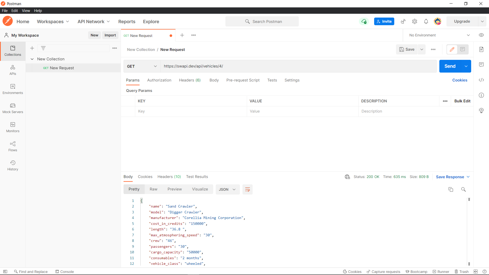
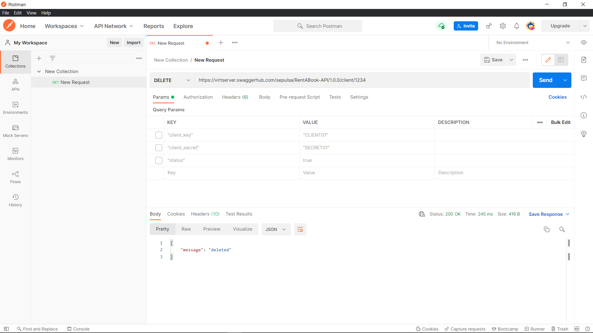

## (19) 19_Intro RESTful API

1. API adalah singkatan dati Aplication Programming Interface, API merupakan sebuah kumpulan dari fungsi dan prosedur yang mengizinkan kita untuk mengakses sebuah fiture atau data terhadap sebuah sistem aplikasi. API bekerja dengan cara client yang melakukan request ke server kemudian server mengirimkan response sesuai dengan request yang diminta oleh client. kita bisa mengintergrasi frontend yang banyank dengan hanya 1 API saja, selain itu API juga bisa berintegrasi antara backend dengan backend.
2. REST merupakan singkatan daru REpresentational State Transfer, artinya sekumpulan aturan untuk memnangun aplikasi terdistribusi. Rest menggunakan http protocol untuk berkomunikasi. GET untuk mengambil sebuat data, POST untuk memasukkan data, PUT untuk edit data, DELETE untuk hapus data. Ada beberapa tipe atau jenis request dan response format, diantaranya JSON. JSON adalah sebuah format data yang digunakan untuk pertukaran dan penyimpanan data. JSON memiliki key dan value dan dapat diakses dengan KEY itu sendiri. rules http response code adalah untuk mengidentifikasi apakah request yang kita lakukan itu berhasil atau tidak. Jenis-jenisnya diantaranya, 200 OK (ketika request berhasil), 201 created (ketika proses PUT/POST berhasil), 400 Bad Request (ketika gagal melakukan POST/PUT), 404 Not Found (ketika menunjukkan bahwa tidak ada request yang diminta client), 401 Unauthorized (ketika client tidak memiliki hak untuk mengakses sesuatu), 405 Method Not Allowed (ketika metode nya tidak sesuai dengan end point yang ada), 500 Internal Server Error (ketika terjadi kesalahan di sisi server).
3. API testing Tools salah satunya adalah Postman. Postman adalah HTTP client untuk melakukan testing web sercice.

### Task
Target API 1

Target API 2

Target API 3
GET

POST

PUT

DELETE
