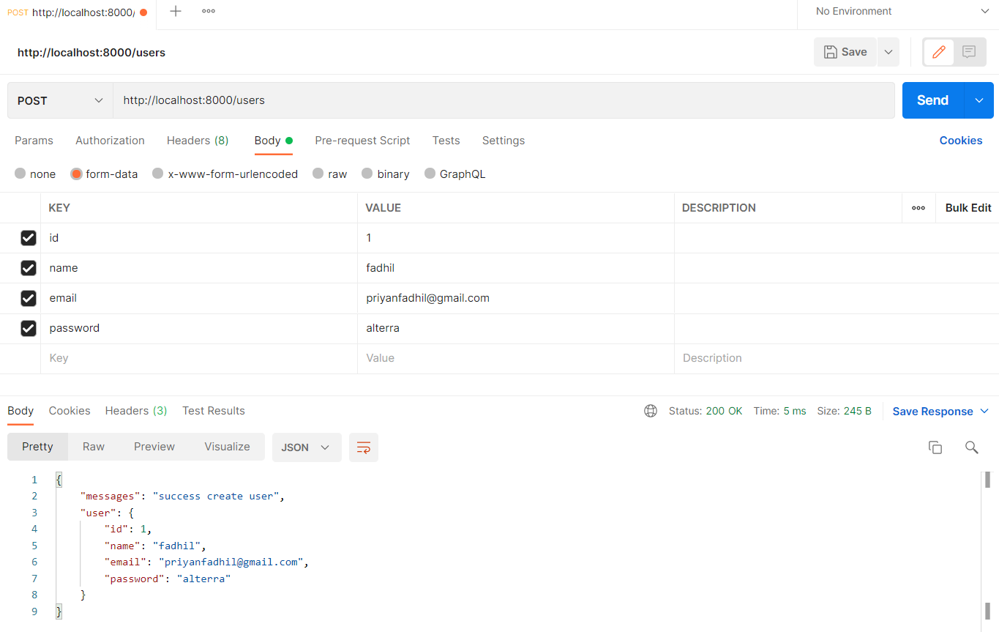
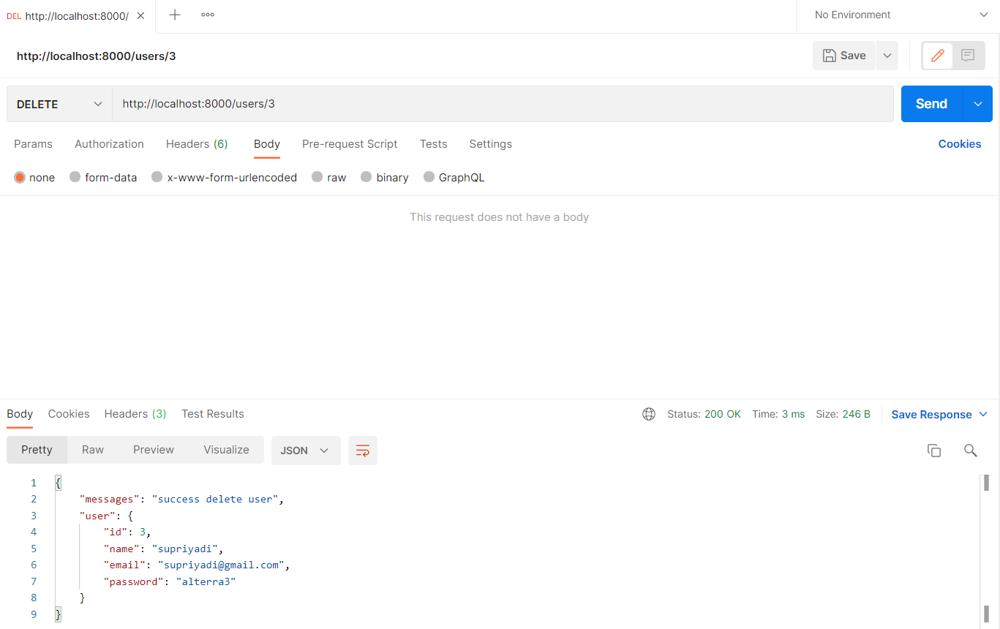
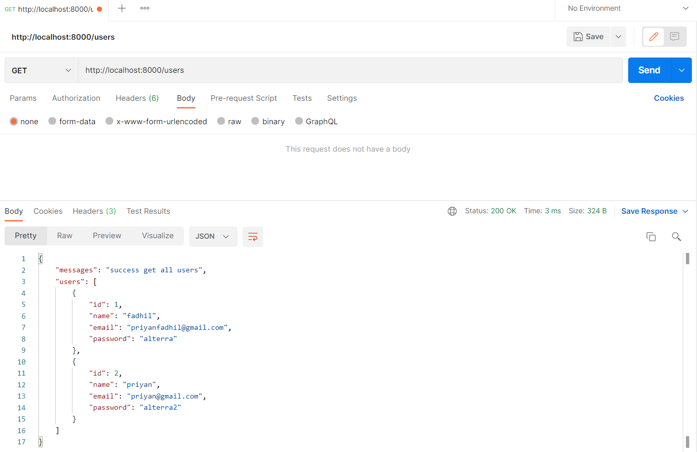

## (20) Intro Echo Golang

1. Third party atau library merupakan senuah kumpulan dari sebuah code yang memiliki fungsi-fungsi tertentu, dimana fungsi tersebut dapat dipanggil code lain. library populer salah satunya adalah echo library restAPI. 
2. Echo adalah sebuah web framework golang yang mempunyai performa tinggi, dan extensible atau dapat dipasang pasang dan minimalis. keunggulan echo dibanding yang lain adalah performansi echo lebih cepat, selain itu dia optimezad router karena optimasi prioritas routing yang cerdas, kemudian middleware yang beragam, lalu data rendering yang mudah dalam memberikan response, kemudian scalable, dan data binding. Echo itu minimalist artinya sederhana, ukurannya tidak terlalu besar, namun powerful. echo minimalist namun ekstensible artinya mudah dihubungkan dengan library lainnya untuk saling mendukung.
3. terdapat 3 cara untuk melakukan Create Read Update Delete pada Static API, bisa menggunakan URL params, bisa juga dengan Query Params, terakhir bisa menggunakan form. Pengiriman data yang dilakukan juga biasanya menggunakan JSON, caranya dengan mengubah inputan pada body di postman menjadi raw. kita juga dapat melakukan binding data sehingga kita tidak perlu memabuat satu satu datanya dan dapat ditampung dalam 1 variable yang mengarah ke struct.

### Task
Pertama-tama saya membuat 3 user untuk diuji coba apakah code yang saya buat telah berjalan dengan baik, 3 user tersebut sebagai berikut :

kemudian saya mengubah isi data dari user dengan id 1 sehingga :

lalu menghapus user dengan id 3 sehingga :

dan menampilkan user dengan id 2 :

Terakhir saya mengeluarkan semua user yang pernah di create :
