## (21) ORM and Code Structure (MVC)

1. Object Relational Mapping (ORM) akan membantu kita ketika mengonversi data antara tipe yang tidak kompatibel, sistemnya menggunakan objek oriented programming. Kelebihan ORM diantaranya adalah less repetitive query artinya tidak banyak menggunakan query, lalu ketika kita mendapatkan data maka akan otomatis tersimpan kedalam variable struct kita, kemudian validasi data lebih mudah, lalu ORM mempunyai feature cache query. Sedangkan kelemahan ORM antara lain adalah code nya lebih banyak juga proses nya memberatkan di bagian operasi kita, lalu ORM dapat mengeksekusi query yang tidak diinginkan sehingga menambah cost ketika operasi, kemudian kompleksiti query bisa terlalu panjang jika ditulis dengan ORM, lalu ketergantungan terhadap library.
2. GORM merupakan fungsi ORM yang merupakan RDBMS. GORM dapat dipasangkan dengan framework yang sudah dibuat sebelumnya. data migration penting dalam industri karena ketika melakukan update pada kolom database maka migrate akan melakukan tracking siapa yang menambahkan atau apa yang ditambahkan di versi yang baru. fungsi GORM akan memungkinkan kita melakukan auto migration. dan alasan mengapa kita melakukan db migration adalah ketika kita mengupdate database lebih simple dan ketika melakukan rollback lebih simple lagi, yang paling penting adalah kita bisa melakukan tracking perubahan database kita, terakhir kita akan selalu compatible jika menggunakan migration dari aplikasi terbaru dengan yang ada di database.
3. MVC adalah sebuah struktur yang terdiri dari model, view, controllers. Artinya nanti projek kita dipecah menjadi bagian bagian tersebut sehingga lebih mudah dibaca. Model itu seperti struct dimana model dari struktur data yang akan dimasukkan ke database. controller adalah isi dari logic bisnis nya kita, view adalah bagian awal seperti main.

### Task 1
Pertama-tama saya membuat 3 user untuk diuji coba apakah code yang saya buat telah berjalan dengan baik, 3 user tersebut sebagai berikut :
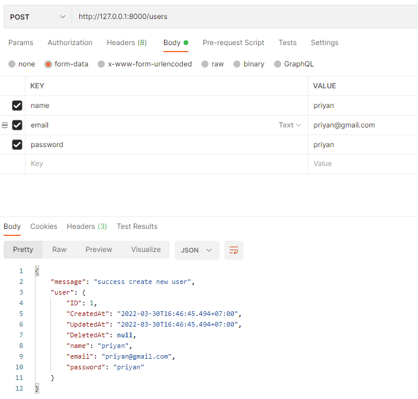
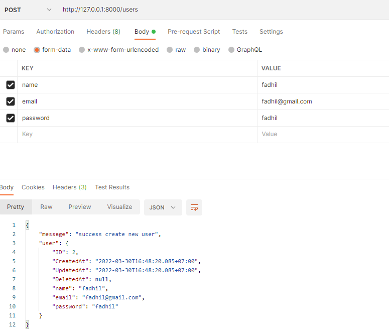
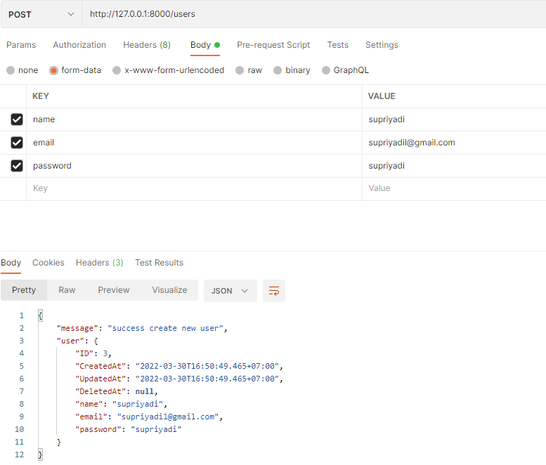

kemudian saya mengubah isi data dari user dengan id 2 sehingga :
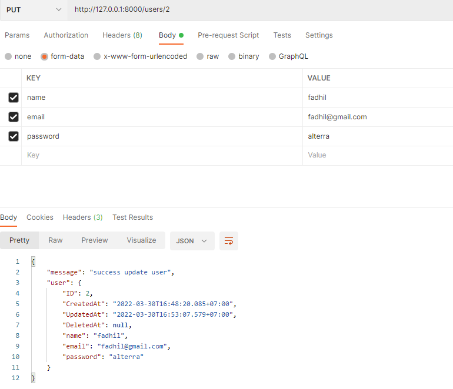

mengeluarkan semua user yang pernah dibuat :
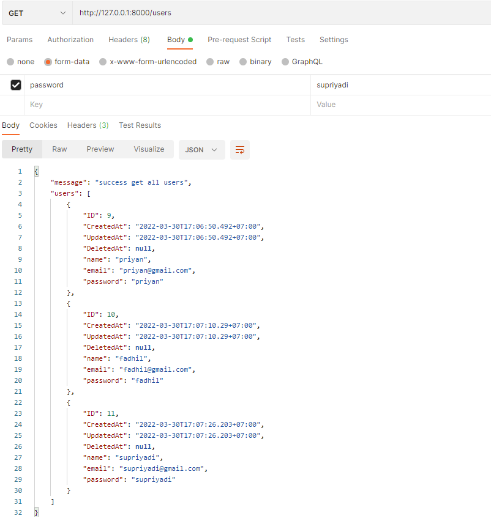

lalu menghapus user dengan id 11 sehingga :
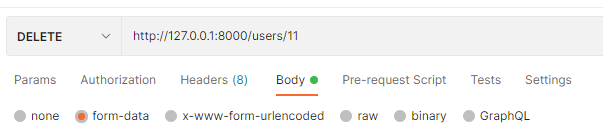

maka user dengan id 11 telah terhapus :
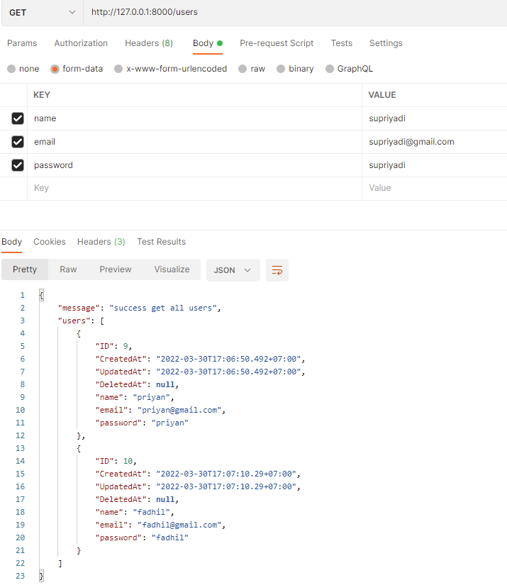

dan menampilkan user dengan id 9 :
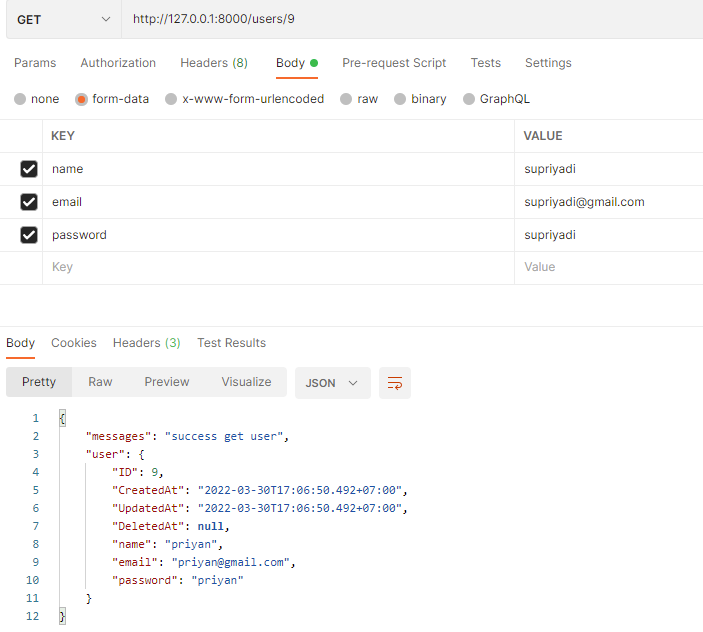

### Task 2
karena isinya sama dengan database sebelumnya sehingga saya langsung mengeluarkan semua data user :
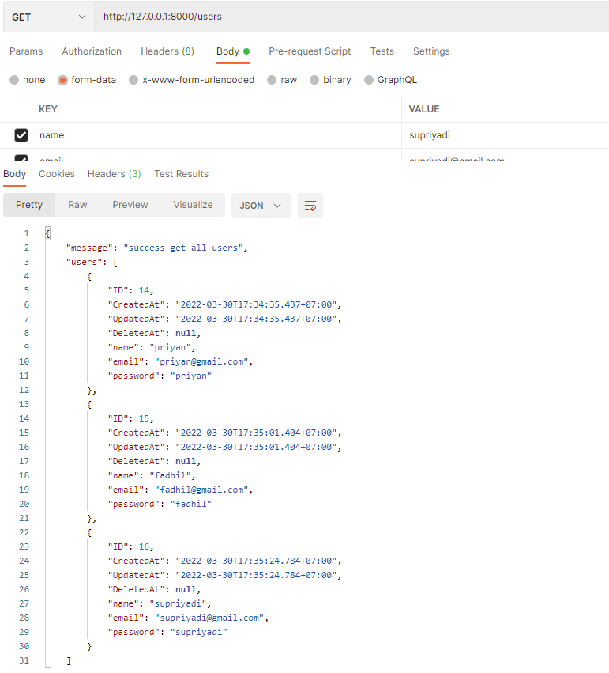

dan menampilkan user dengan id 15 :
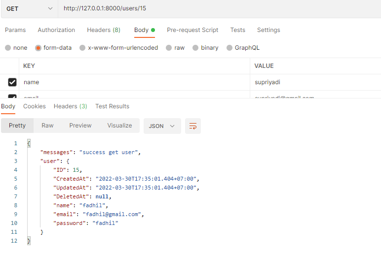

kemudian saya membuat user baru :
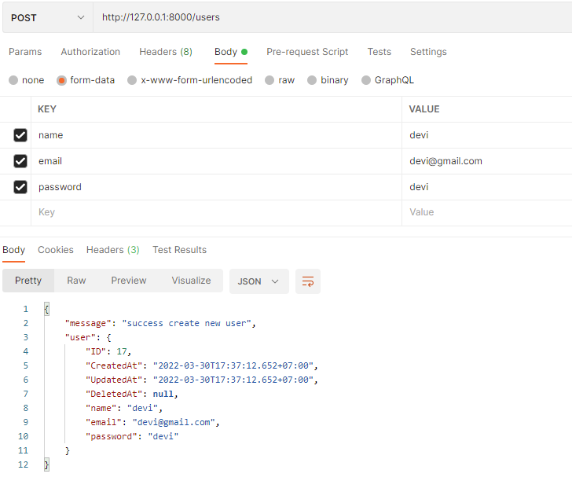

lalu menghapus user dengan id 15 sehingga :
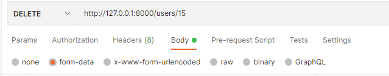

maka user dengan id 15 telah terhapus :
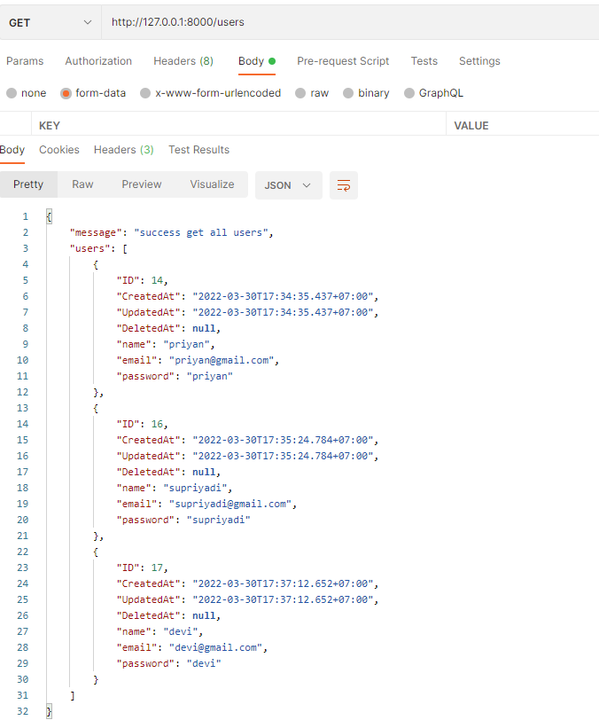

kemudian saya mengubah isi data dari user dengan id 17 sehingga :
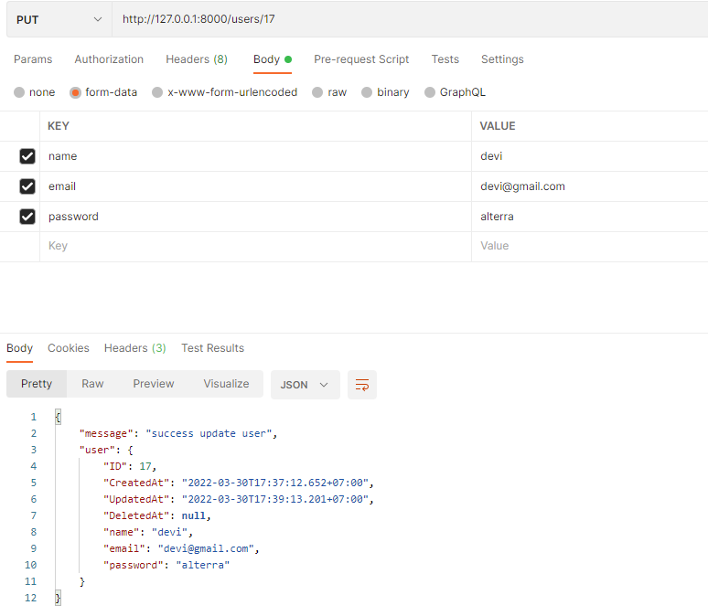

karena logic dari user sama dengan logic dari books maka saya rasa saya cukup menampikan bahwa layered yang dibuat telah berhasil :
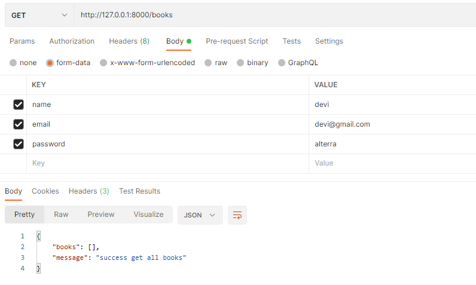