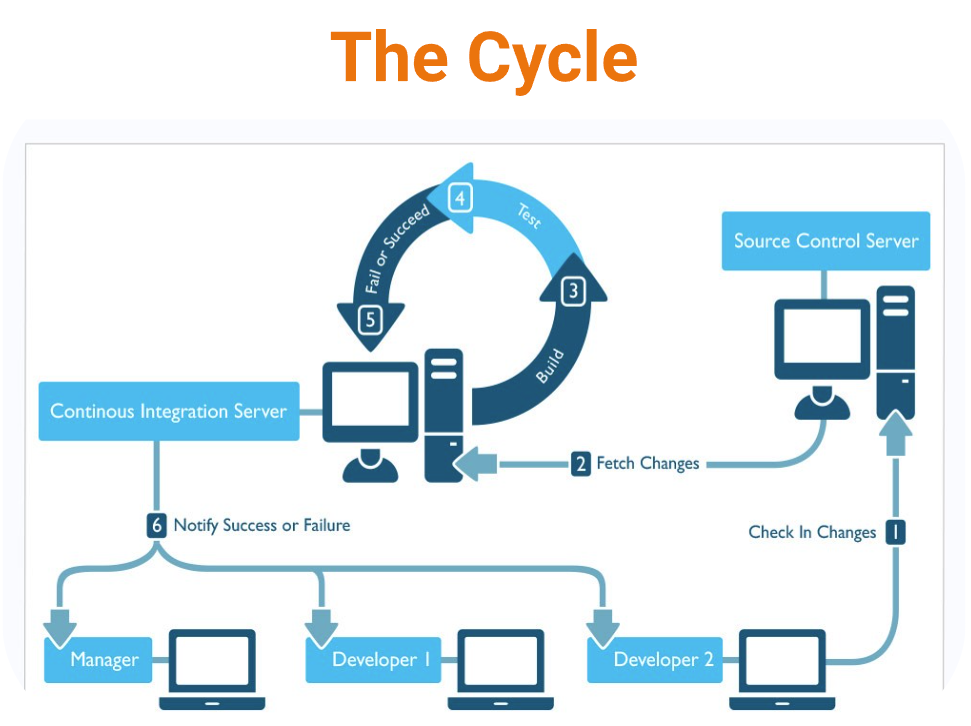
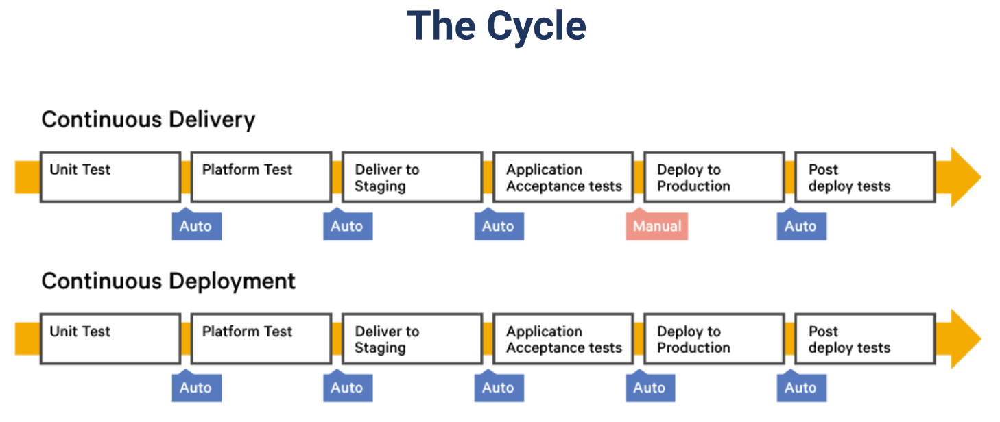

## (28) Compute Services

1. CI atau Continuous Integration adalah sebuah proses otomatis untuk mengintegrasikan berbagai jenis code dari potensial source yang berbeda untuk dilakukan build dan juga testing. adapun gambaran life cycle pada CI adalah seperti berikut 

2. CD atau continous delivery atau continous deployment merupakan deployment yang dilakukan secara automerge ketika kita membuild aplikasinya berhasil. Adapun life cycle dari CD yaitu :

3. tools yang digunakan untuk membuat ci/cd adalah code commit nya menggunakan git, untuk build menggunakan docker, scan&test menggunakan go(echo) dan sonar, release menggunakan serena, deploy menggunakan docker